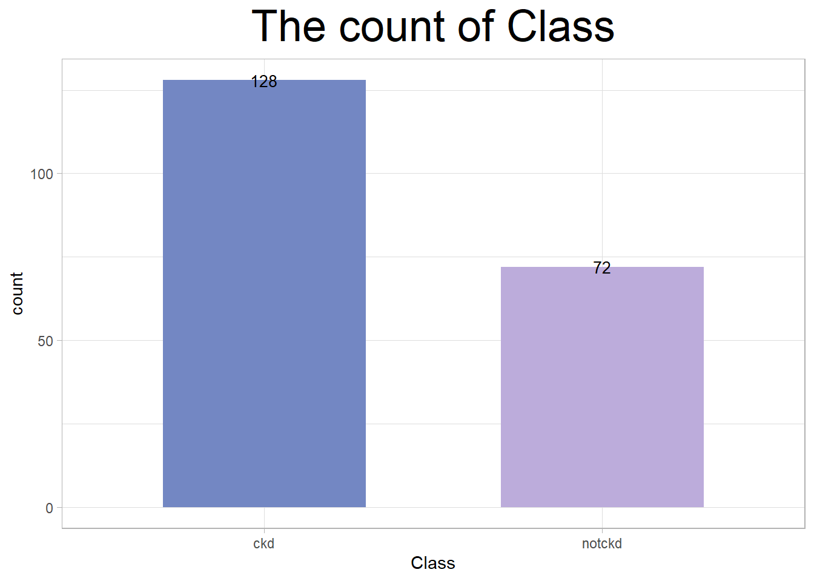

# Assignment3

- author: RachelBai

- contributor: Jessie Hughes

- The links to personal Github accounts

- image with caption:

```{r echo=FALSE, message=FALSE, warning=FALSE}
library(readr)
library(ggplot2)

ckd1 <- read_csv("https://raw.githubusercontent.com/RachelBai0525/assignment-3-zb93/main/ckd1.csv")
closet <- c("#7387c3","#bcacdb")
p <- ggplot(ckd1,mapping = aes(x = Class)) +geom_bar(stat = 'count',fill = closet,width = 0.6)+
  geom_text(stat='count',aes(label=..count..),
            color="black",size=3.5,position=position_dodge(0.5)) +
theme_light()+ggtitle("The count of Class")+
theme(plot.title = element_text(hjust = 0.5,size = 27))
```




